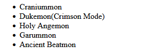
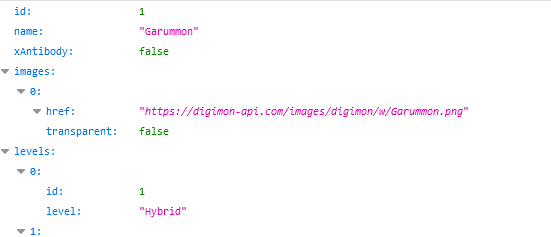
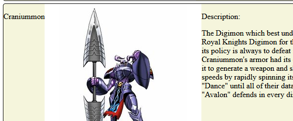

# Opdrachten modules

## Mappen aanmaken

1. Ga naar waar jouw school werk staat
2. Ga naar de map/directory `M2 prog js`
Uit de vorige les!
3. Maak een map `eindopdrachtweb`
4. Open de `eindopdrachtweb` folder in visual studio code

## files opzetten

1. Kopieer files van het `les1` naar 
 `eindopdrachtweb`

 * `index.html`
 * `app.js`

2. open de directory `modules` in visual studio code

## javascript fetch! 

we gaan de fetch api gebruiken van javascript. Deze moderne library zit in alle browsers. 
Deze gebruiken we om web content op te halen naar onze pagina of javascript toe.

* denk aan API calls
* data files ophalen
* stukken html ophalen
* etc

1. lees je in de API in:

we gaan digimon ophalen vanuit de site `https://www.digi-api.com` die biedt een `REST-api` aan. Dat is een manier om data op te halen uit bijvoorbeeld een database via een webservice

1. We gaan eerst eens kijken of we een lijstje van digimon kunnen ophalen: gebruik de  url `https://www.digi-api.com/api/v1/digimon`
2. Open die eerst maar even in je browser en kijk even naar de data
3. gebruik `fetch` om deze url op te halen. 
4. gebruik de '`then` function om uit de `response` de `json` te halen (`response.json()`)
5. haal uit deze `json` (kan je net als een object gebruiken) de `naam` en de detail `url` en zet deze in losse `variabelen`
6. schrijf deze met `console.log` naar de console.
7. controlleer of het werkt

## voorbereiden voor het tonen in html

1. maak voor de namen een `<ul>` tag aan in je html (dit is een list)

2. geef deze `ul` tag een `uniek id`

## terug naar javascript

1. haal de `<ul>` met `document.getElementById` en bewaar deze in een variabel
2. maak met `document.createElement("...")` een nieuw `li` tag aan
3. voor de `li` tag zet je de `textContent` met de `name` uit de variabel die je al had opgeslagen 
4. het `ul` object in javascript heeft een `.appendChild()` function. `append` nu de nieuwe `li` tag zodat deze op de pagina te zien is.
5. controlleer je resulaat:

## meer data ophalen

1. we hadden ook de `url` opgeslagen. Deze gaan we nu gebruiken om per digimon een detail `<article>` te maken
2. haal per digimon met de `fetch-api` de `url` op

3. schrijf de `json` naar de console
4. controlleer of je voor `Garummon` dit terug krijgt:

5. zie je hoe je zo door de api heen kan gaan? net als een website kan je links volgen. Dit werkt ook als je het in je browser doet

## detail articles maken

1. nu hebben we per digimon de details opgehaald deze gaan we laten zien

2. bedenk eerst hoe je je html per `article` gaat maken (denk aan welke tags je erin gaat zetten). Zorg dat je de volgende velden hebt:
* name
* description
* img (een `img` tag)

3. maak deze nu aan met javascript (`document.createElement(...)`)
4. geef de `name`, `description` en `img` tags nu waarden die uit de `json` data komen zodat je de digimon goed kan weergeven

## dynamisch op user input reageren

1. maak een `input` tag van het type `text` aan en een `button` in je `html`

2. als je op de knop clicked moet je de `text input` lezen.
3. zoek nu de digimon op met `fetch` in de `https://www.digi-api.com/` en laat deze op de pagina zien door een `article` toe te voegen

## Extra:

* probeer een `template html` te maken en die te gebruiken voor je `digimon detail kaart` zodat je niet alle tags in javascript hoeft te maken
* sla je toegevoegde digimon op met de `local storage api` ()
* style je pagina en digimon `cards`
* gebruik een externe style `.css` file ()
* heb je al flexbox css gehad? gebruikt dat (zie ook flexbox froggy voor oefeningen)

## klaar?

1. commit & push je werk naar github

